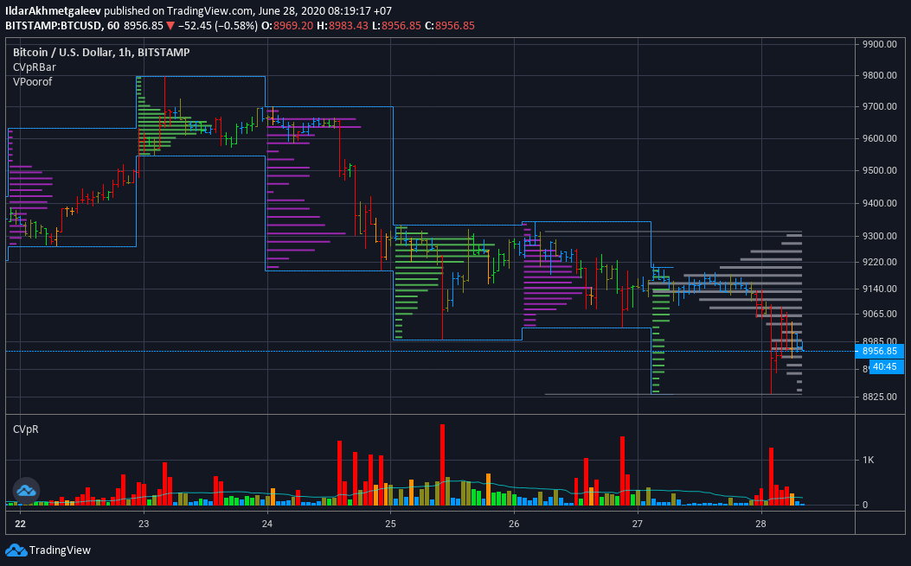

# Poor man's volume profile

This is an attempt to get something more or less similar to the volume profile for free.




## Install

Add [indicator][install] to you TradingView chart


## Build

```bash
# install jinja2
pip install jinja2
# generate code
./generate.py > my_indicator.pine
```

[install]: https://www.tradingview.com/script/IWdpl712-Poor-man-s-volume-profile/
